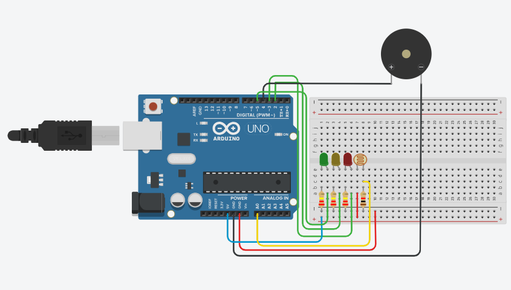
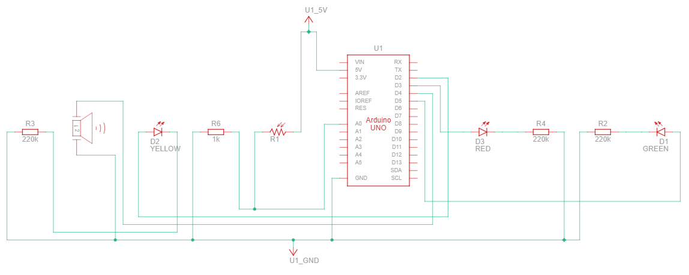

# 🍷 Vinheria Agnello - Sistema de Monitoramento (Luminosidade)
Sistema embarcado com Arduino que realiza a leitura da luminosidade e executa ações com base nos dados coletados.
# 📋 Descrição do Projeto
Este projeto consiste em um sistema de monitoramento de luminosidade usando um sensor fotorresistor (LDR) conectado a um Arduino Uno. O sistema lê continuamente a intensidade luminosa do ambiente e aciona LEDs coloridos e um buzzer para informar o estado atual:

| Faixa | LED | Buzzer | Ação |
|:-----:|:---:|:------:|:-----|
| 🟢 Ideal | Verde **ON** | OFF | Luminosidade dentro do nível seguro para conservação dos vinhos |
| 🟡 Atenção |  Amarelo **ON** | Buzzer(3s) | Luminosidade elevada — recomenda-se verificar o ambiente
| 🔴 Crítico | Vermelho **ON** | ON/OFF (3s/3s) | Luminosidade acima do limite — ação imediata necessária para proteger os vinhos

# 🛠️ Lista de Componentes
| Quantidade | Componente |
| :----------| :--------------------: |
|1| Arduino Uno R3
|1| Protoboard
|1| Led Verde
|1| Led Amarelo
|1| Led Vermelho
|1| Buzzer
|1| Fotorresistor
|1| Resistor de 1kΩ
|3| Resistor de 220kΩ
|-| Jumpers Macho-Macho

# 📐 Diagramas
### 🖼️ Diagrama do Circuito

### 🖼️ Diagrama Esquético

# 👥 Partipantes
| Nomes         | RM             |
| :-------------| :------------: |
| Felipe Rabelo |  570340
| Gustavo Ferreira Tavares | 569928 |
| Ricardo Salmerón | 572916 |